==========================================================
Towards a full stack Python monitoring+analytics framework
==========================================================

`Pablo Manuel García Corzo (pablo.manuel.garcia@blue-tc.com) <mailto:pablo.manuel.garcia@blue-tc.com>`_

----

About us
========

.fx: section

`Blue Telecom Consulting (BlueTC®) <http://blue-tc.com>`_ provides innovative solutions and services aimed at evolving and optimising telecom networks to operators, system integrators and network equipment manufacturers.

**BlueTC’s Innovation Team** has been working during past 3 years for **international customers** on projects mainly related with three key fields: **Openstack (NFV/SDN)**, **Data Analytics** and **Real Time Systems Monitoring**. 

We have been identifying lacks in the tools currently used by our customers, and designing specific solutions to encourage telco operators and network equipment vendors towards a monitoring and analytics framework really capable of facing the new challenges.

Pablo Manuel García Corzo
-------------------------

I'm a **physicist**, a **Python enthusiast** and BlueTC's **Solutions Architect**.

----

Reason of the need
==================

.fx: section

Are traditional monitoring solutions ready for the software defined world (**SDN/NFV**) and the Internet of Things (**IoT**)?

**Not always.**

New challenges
--------------

 * analytics layer integration
 * heterogeneous data sources 

   * devices
   * formats 
   * transport protocols
 * increasing flow of data (scalability)

----

Traditional Monitoring
----------------------

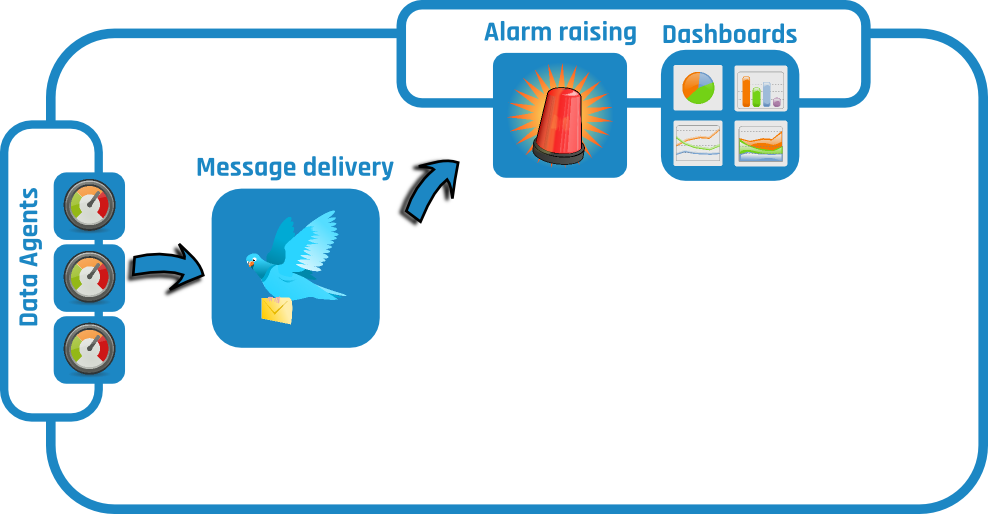

Presenter Notes
---------------

It’s quite probable that **you already have a standard monitoring tool** deployed in your production environment reading **thousands of KPIs** from your systems **every minute**. 

----

Why python?
===========

**Python** raises as an advanced player:
    
.fx: section

 * It is strongly positioned in the race to become the **state of the art in Big Data analytics** 

 * It offers a **general purpose programming language** (not only statistics)

 * It’s difficult to find modern software projects not offering python APIs or connectors for **easy integration**

----

Python in Data Science
----------------------

`Source: kdnuggets <http://www.kdnuggets.com/polls/2015/analytics-data-mining-data-science-software-used.html>`_

.. image:: images/top10-analytics-data-mining-software-2015.jpg
   :width: 80%
   :align: center

----

Trends
------

`Source: kdnuggets <http://www.kdnuggets.com/polls/2015/analytics-data-mining-data-science-software-used.html>`_

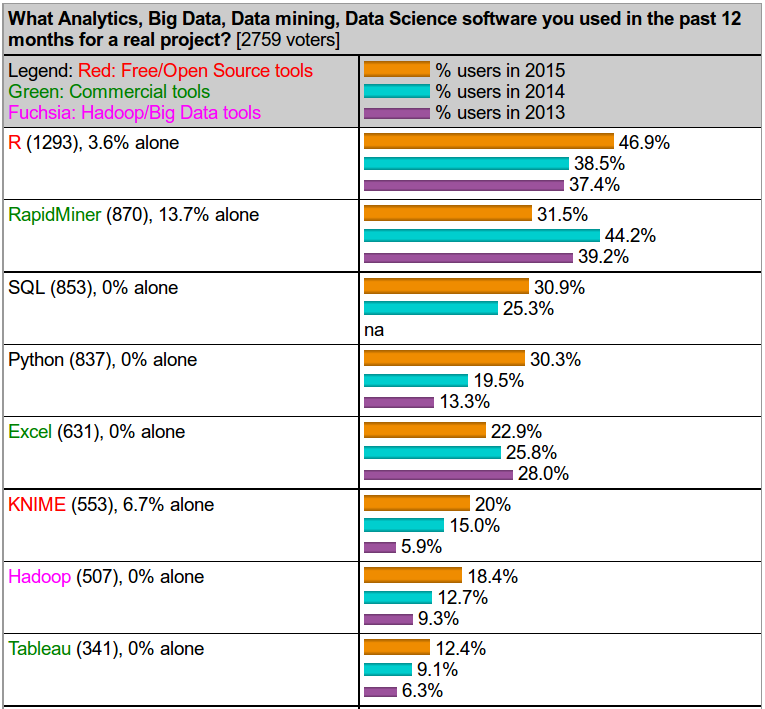

----

Python for general purpose
--------------------------

`Source: qz.com <http://qz.com/378939/the-most-popular-programming-languages-are-rapidly-changing/>`_

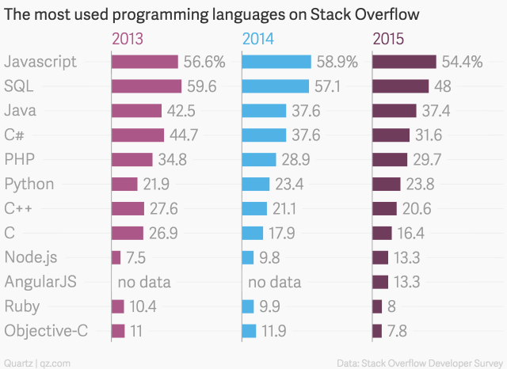

----

Because it rocks
----------------

.. image:: images/python.png
   :width: 60%
   :align: center

----

Analytics layer
===============

.fx: section

 * Most monitoring tools consider **Analytics** as **a post-processing add-on**

 * **Not an integrated** part of the monitoring workflow

 * No feedback for alarm raising

 * The ideal would be to use analytics even to **identify the Key Performance Indicators** (KPIs) of your environment
 
 * Alarms based on **thresholds to isolated measures are not significant enough**

----

Analytics layer in framework
----------------------------

.. image:: images/analytics.png
   :width: 90%
   :align: center

Presenter Notes
---------------

As you may suspect, there’s much more **interesting information** hidden in all that data than just simple threshold based alarms per kpi and you wish to exploit it in much more depth.

This talk will take a look at several python tools and libraries for covering not only the missing pieces in traditional monitoring but all of them.

As a conclusion we’ll try to design and build a **full stack Python** monitoring+analytics framework.

----

KPI Manufacture
---------------

.fx: blue_section

Once we can access stored data it's time for KPI manufacturation.

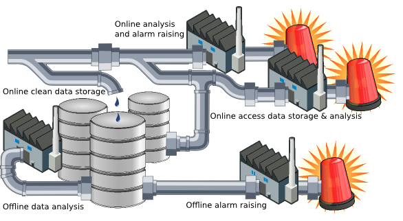

----

Tasks
-----

 * Pluggable python modules 
 * One or more well defined inputs and outputs
 * Execution time control
 * Common logging strategy

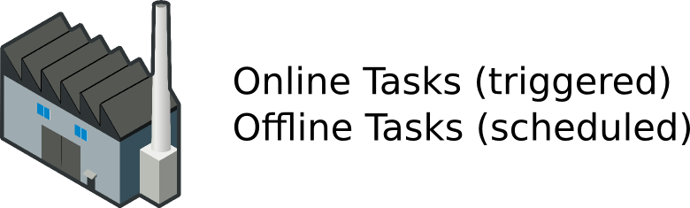

Online Tasks
------------

 * Quick analysis + alarm raising
 * Triggered by incoming data 

Offline tasks
-------------

 * Longer analysis
 * Scheduled in time

----

Workflow Manager
----------------

.. image:: images/ruffus.jpg
   :width: 15%

.. image:: images/ruffus_example.png
   :width: 50%
   :align: right

Ruffus
......

`Ruffus <http://www.ruffus.org.uk>`_ is a Computation Pipeline library for python. It is open-sourced, powerful and user-friendly, and widely used in science and bioinformatics.

 * Task based dependencies (explicit)
 * Decorator based syntax (also `object oriented sintax available <http://www.ruffus.org.uk/tutorials/new_syntax.html>`_) 
 * Generation of graphical flowcharts

.. code-block:: python

   @follows(previous_task)
   def next_task():
       [...]

   @transform(starting_files,  # Input = starting files
	      suffix(".fasta"),#         suffix = .fasta
              ".sam")          # Output  suffix = .sam
   def first_task():
       [...]

   @transform(first_task,    # Input = starting files
	      suffix(".sam"),#         suffix = .sam
              ".bam")        # Output  suffix = .sam
   def second_task():
       [...]

----

Workflow Manager
----------------

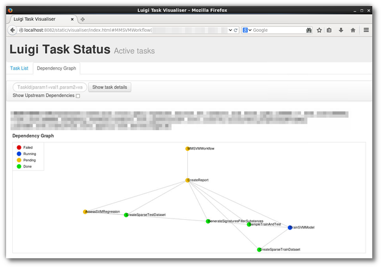

Scientific Luigi
................

`Sci:Luigi <https://github.com/samuell/sciluigi>`_ is a light-weight wrapper library around `Spotify's Luigi <http://github.com/spotify/luigi>`_ workflow system that aims to make writing scientific workflows more fluent, flexible and modular.

 * File (data) based dependencies (*implicit magic*)
 * Object oriented syntax
 * Web based user interface (with graphical flowcharts)
 * Support for Hadoop

.. code-block:: python

   class MyWorkflow(sciluigi.WorkflowTask):
       def workflow(self): 
           foowriter = self.new_task('foowriter', MyFooWriter)
           fooreplacer = self.new_task('fooreplacer', MyFooReplacer,replacement='bar')
           fooreplacer.in_foo = foowriter.out_foo
           return foocleaner
   
   class MyFooReplacer(sciluigi.Task):
       replacement = sciluigi.Parameter() # Here, we take as a parameter
       # Input 
       in_foo = None
       # and output
       def out_replaced(self):
           return sciluigi.TargetInfo(self, self.in_foo().path + '.bar.txt')
       def run(self):
           with self.in_foo().open() as in_f:
               with self.out_replaced().open('w') as out_f:
		   # Do things
		   out_f.write(output)

----

Advanced Python Scheduler
-------------------------

`APScheduler <https://github.com/agronholm/apscheduler>`_ is a Python library that lets you schedule your Python code to be executed later, either just once or periodically. 
 * add new jobs or remove old ones on the fly as you please. 
 * store your jobs in a database (MongoDB + others)
 * integrates with Tornado
 * cron-like scheduling syntax

.. code-block:: python

   from apscheduler.schedulers.background import BackgroundScheduler

   # The "apscheduler." prefix is hard coded
   scheduler = BackgroundScheduler({
       'apscheduler.jobstores.default': {
          'type': 'mongodb'
       },
       'apscheduler.executors.default': {
           'class': 'apscheduler.executors.pool:ThreadPoolExecutor',
           'max_workers': '20'
       },
       'apscheduler.job_defaults.coalesce': 'false',
       'apscheduler.job_defaults.max_instances': '3',
       'apscheduler.timezone': 'UTC',
   })

   scheduler.add_job(myfunc, trigger='interval', minutes=2, id='my_job_id')
   scheduler.reschedule_job('my_job_id', trigger='cron', minute='*/5')
   scheduler.remove_job('my_job_id')

----

Some use cases
--------------

.fx: blue_section

Let's see a couple of examples.

`PyData youtube channel <https://www.youtube.com/user/PyDataTV>`_ is a good place to start searching for good ideas and methods to suck out all the marrow of your data.

 

----

Use case #1: Seasonal parameter
-------------------------------

Threshold-based alarms are just not useful

.. image:: images/deviations.png
   :width: 75%
   :align: center

Interesting KPIs extracted from this single measure would be:

 * Deviation from mean behaviour

----

Use case #1: Seasonal parameter (workflow)
------------------------------------------

.. image:: images/fft_flow.png
   :width: 100%
   :align: center

Integration of a **FFT analysis** for discovering and cleaning periodic patterns.

 * Based on **mean day, week, month**... statistics
 * Weighed by weekday, vacations, paydays, cultural events, etc

----

Use case #2: Time Series Forecast workflow
------------------------------------------

The following is a workflow required to implement a reference `time series forecasting <http://www.analyticsvidhya.com/blog/2016/02/time-series-forecasting-codes-python/>`_ for seasonal parameters

.. image:: images/stationarity_flow.png
   :width: 90%
   :align: center

Presenter Notes
---------------

 * **Trend based alarms** do not require to be online, they have a long time behaviour
 * 

----

Use case #3: Highly correlated parameters
-----------------------------------------

With so much data, there's a clear need to filter interesting information. 
When alarms are clearly correlated there's no need to show them twice. 
Clustering and dimension reduction techniques fit for this purpose.

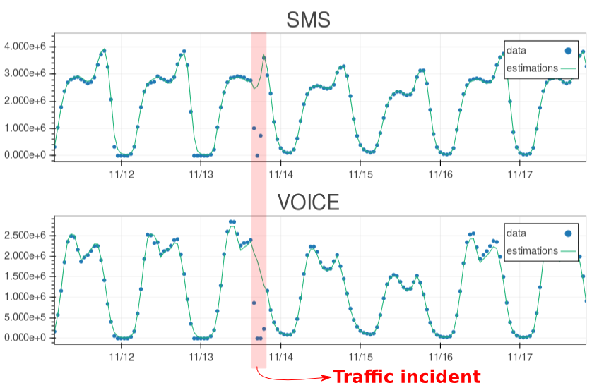

Approach
........

Grouping KPIs based on `affinity propagation (stock market example) <http://scikit-learn.org/stable/auto_examples/applications/plot_stock_market.html#example-applications-plot-stock-market-py>`_

KPI priorization based on `feature selection by pearson correlation <http://blog.datadive.net/selecting-good-features-part-i-univariate-selection/>`_

Presenter Notes
---------------

**WARNING:** this should be used with care, **correlation does not mean causality!**

----

Making data available
---------------------

.fx: section

It's not always easy to access data stored (if any) in traditional monitoring tools... 

Because it was not a design specification for them!

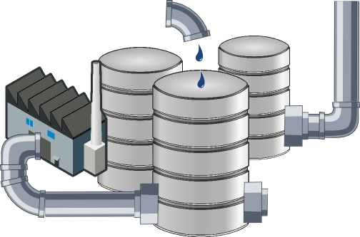

Presenter notes
---------------

That was the scenario we found with our experience. 
Data storage was graph oriented (rrd) and retrieving it became quite obscure and underoptimal.

----

Round Robin Database Tool
-------------------------

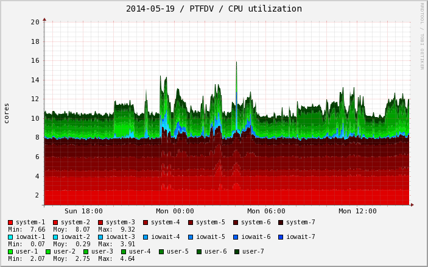

`RRDtool <http://oss.oetiker.ch/rrdtool/>`_ is the OpenSource industry standard, high performance data logging and graphing system for time series data. RRDtool can be easily integrated in shell scripts, perl, python, ruby, lua or tcl applications.

 * Not very flexible (unable to store)
 * *Awful* static graphics (but for free)
 * Time interpolation by default
 * Unavoidable deletion of old data
 * Can't store *past* data (if you miss an update for some reason you have no simple way of back-filling)
 * No multiple updates into a single operation
 * Serious issues with irregular data (RRD drops irregular data points)

rrdpython
.........

`rrdpython <https://oss.oetiker.ch/rrdtool/prog/rrdpython.en.html>`_ offers python libs integrated... **BUT** it's not very *pythonic*:

.. code-block:: python

   rrdtool.graph(path,
              '--imgformat', 'PNG',
              '--width', '540',
              '--height', '100',
              '--start', "-%i" % YEAR,
              '--end', "-1",
              '--vertical-label', 'Downloads/Day',
              '--title', 'Annual downloads',
              '--lower-limit', '0',
              'DEF:downloads=downloads.rrd:downloads:AVERAGE',
              'AREA:downloads#990033:Downloads')

Presenter Notes
---------------

**Whisper** is a fixed-size database, similar in design to RRD (round-robin-database) with some of this issues improved.

----

HDF5
----

.. image:: images/HDF.jpg
   :align: left

`HDF5 <https://www.hdfgroup.org/HDF5/>`_ is a data model, library, and file format for storing and managing data. It supports an unlimited variety of datatypes, and is designed for flexible and efficient I/O and for high volume and complex data. HDF5 is portable and is extensible, allowing applications to evolve in their use of HDF5. 
The HDF5 Technology suite includes tools and applications for managing, manipulating, viewing, and analyzing data in the HDF5 format. 

.. image:: images/hdf5_structure.jpg
   :align: center
   :width: 75%

----

Python and HDF5
...............

`h5py <http://www.h5py.org/>`_

.. code-block:: python

 import h5py
 import numpy
 file = h5py.File('dset.h5','w')
 dataset = file.create_dataset("dset",(4, 6), h5py.h5t.STD_I32BE)
 #dataset = file['/dset']
 data = numpy.zeros((4,6))
 for i in range(4):
    for j in range(6):
    data[i][j]= i*6+j+1 
 dataset[...] = data
 print "Reading data back..."
 data_read = dataset[...]
 print "Printing data..."
 print data_read
 file.close()

`Supported in pandas <http://pandas.pydata.org/pandas-docs/stable/io.html#hdf5-pytables>`_ thanks to `PyTables <http://www.pytables.org/>`_

.. code-block:: python

   import numpy as np
   from pandas import HDFStore,DataFrame
   # create (or open) an hdf5 file and opens in append mode
   hdf = HDFStore('storage.h5')
   df = DataFrame(np.random.rand(5,3), columns=('A','B','C'))
   hdf.put('d1', df, format='table', data_columns=True)
   hdf.append('d1', DataFrame(np.random.rand(5,3), 
   columns=('A','B','C')), 
   format='table', data_columns=True)
   hdf.close() # closes the file

Presenter Notes
...............

 * Single Writer Multiple Reader (SWMR)

The SWMR feature is currently in prototype form and available for experimenting and testing. Please do not consider this a production quality feature until the HDF5 library is released as 1.10.

----

Gnocchi
-------

.. image:: images/gnocchi.jpg
   :align: left
   :width: 25%

Time Series Database as a Service
.................................

`Gnocchi <http://gnocchi.xyz>`_ is a multi-tenant timeseries, metrics and resources database. 
It provides an HTTP REST interface to create and manipulate the data. It is designed to store metrics at a very large scale while providing access to metrics and resources information to operators and users.

Gnocchi is part of **the OpenStack project**. While Gnocchi has support for OpenStack, it is fully able to work stand-alone.

The canonical implementation of the time series storage is based on the use of **Pandas** and Swift.

Integration with `grafana <http://grafana.org>`_.

.. image:: images/grafana.png
   :width: 50%
   :align: right

gnocchiclient
.............

.. code-block:: python

   from gnocchiclient.v1 import client
   gnocchi = client.Client(...)
   # session=None, service_type='metric'
   # session (keystoneauth.adapter.Adapter)
   gnocchi.resource.list("instance")
   

Presenter Notes
---------------

 * Looks **really** promising
 * Lacks good documentation, really difficult to follow
 * Great place to start if you want to collaborate

----

Arctic
------

.. image:: images/arctic.png
   :align: left
   :width: 25%

Arctic is a high performance datastore for numeric data. It supports Pandas, numpy arrays and pickled objects out-of-the-box, with pluggable support for other data types and optional versioning.

Arctic can query millions of rows per second per client, achieves ~10x compression on network bandwidth, ~10x compression on disk, and scales to hundreds of millions of rows per second per **MongoDB** instance.

 * Based on **MongoDB**, very python friendly.
 * Support for **VersionStore** (key-value versioned TimeSeries) 
 * Support for **TickStore** (designed for large continuously ticking data)

.. code-block:: python

	  from arctic import Arctic
	  # Connect to Local MONGODB
	  store = Arctic('localhost')
	  # Create the library - defaults to VersionStore
	  store.initialize_library('MyLibrary')
	  # Access the library
	  library = store['MyLibrary']
	  # Load some data - maybe from Quandl
	  library.write('MyData', my_loaded_data, metadata={'source': 'Where it came from'})

	  # Reading the data
	  item = library.read('MyLibrary')
	  data = item.data
	  metadata = item.metadata

----

Clients and Brokers
===================

.fx: section

 * HTTP-based (ncpa, dweet.io, phant)
 * MQTT (paho, hbmqtt)
 * CoAP
----

Introduction of new protocols
-----------------------------

.. image:: images/protocols.png
   :width: 90%
   :align: center

Presenter Notes
---------------

Monitoring tools use to be ready for their own agents... flexibility needed.

----

HTTP based choices
------------------

NCPA Nagios agent
.................

Could be easily used standalone... Well, `in fact you can't <https://github.com/NagiosEnterprises/ncpa/blob/master/LICENSE.md>`_:

  6. The Software may only be used in conjunction with products, projects, and other software distributed by the Company. Any standalone use of the Software, or use of the Software in conjunction with products, projects, or other software not authored or distributed by the Company - including third-party software that competes with the offerings of Company - is strictly prohibited and is a direct violation of the terms of the license.

.. image:: images/dweet.jpg
   :align: right
   :width: 30%

pydweet
.......

`dweet.io <http://dweet.io>`_

 * Non-free (as in freedom) server
 * Hosted service free (as in free beer) for public data
 * Ridiculously simple
 * Interesting and fun
 * MIT license 
 * Alarms (non-free)
 * Integrates with freeboard

.. code-block:: python

   from dweet import Dweet
   #dweet an dweet without a thing name. Returns a a thing name in the response
   print dweet.dweet({"hello": "world"})
   #dweet with a thing name
   print dweet.dweet_by_name(name="test_thing", data={"hello": "world"})
   #get the latest dweet by thing name. Only returns one dweet.
   print dweet.latest_dweet(name="test_thing")
   #get all the dweets by dweet name.
   print dweet.all_dweets(name="test_thing")

---- 

HTTP based choices
------------------

phant
.....

.. image:: images/phant.png
   :align: left
   :width: 20%
 
Phant is a modular node.js based data logging tool for collecting data from the Internet of Things. It is the open source software that powers `data.sparkfun.com <http://data.sparkfun.com/>`_, and is actively maintained by SparkFun Electronics.

 * Easy to use, free hosted option
 * GPL v3

`python-phant <https://github.com/matze/python-phant>`_

.. code-block:: python

 import sys
 from phant import Phant
 p = Phant(publicKey='xyzpublickey', fields=['temp', 'humid'], privateKey='abcprivatekey')
 t = 33.4
 h = 10.2
 p.log(t, h)
 print(p.remaining_bytes, p.cap)
 data = p.get()
 print(data['temp'])

Presenter Notes
---------------

Adafruit
........

`Comming soon... <https://blog.adafruit.com/2014/09/16/coming-soon-adafruit-io/>`_

----

Write your own: Tornado
-----------------------

.. image:: images/tornado.png
   :align: right
   :width: 20%

.. image:: images/requests.png
   :align: left
   :width: 20%

**It's easy and fun!**

`Tornado <http://www.tornadoweb.org/>`_ is a Python web framework and asynchronous networking library. 

`Requests <http://docs.python-requests.org/en/master/>`_ is the only Non-GMO HTTP library for Python, safe for human consumption.

Broker
......

.. code-block:: python

   class MessageHandler(tornado.web.RequestHandler):
	  @gen.coroutine
	  def get(self, *args):
	      uri=[ y for y in self.request.uri.split('/') if y != '']
              response = json.dumps(MESSAGES.pop(uri[1]), indent=4)
              self.write(response)
              self.set_header("Content-Type", "application/json")
	  @gen.coroutine
	  def post(self, *args):
	      uri=[ y for y in self.request.uri.split('/') if y != '']
              data = json.loads(self.request.body)
              MESSAGES.append(data, uri[1])
              response = json.dumps(data, indent=4)
              self.write(response)
              self.set_header("Content-Type", "application/json")

Client
......

.. code-block:: python

   payload = r.text
   r = requests.post('http://server.url/myqueue', data = {'key':'value'})
   r = requests.get('http://server.url/myqueue')
   
----

MQTT
----

.. image:: images/mqttorg.png
   :align: left

`MQTT <http://mqtt.org>`_ is a **machine-to-machine** (M2M)/"Internet of Things" connectivity protocol. 

* extremely lightweight publish/subscribe messaging transport

* useful for connections with remote locations 

* small code footprint 

It has been used in: 

* sensors communicating to a broker via satellite link
* over occasional dial-up connections with healthcare providers
* home automation and small device scenarios. 

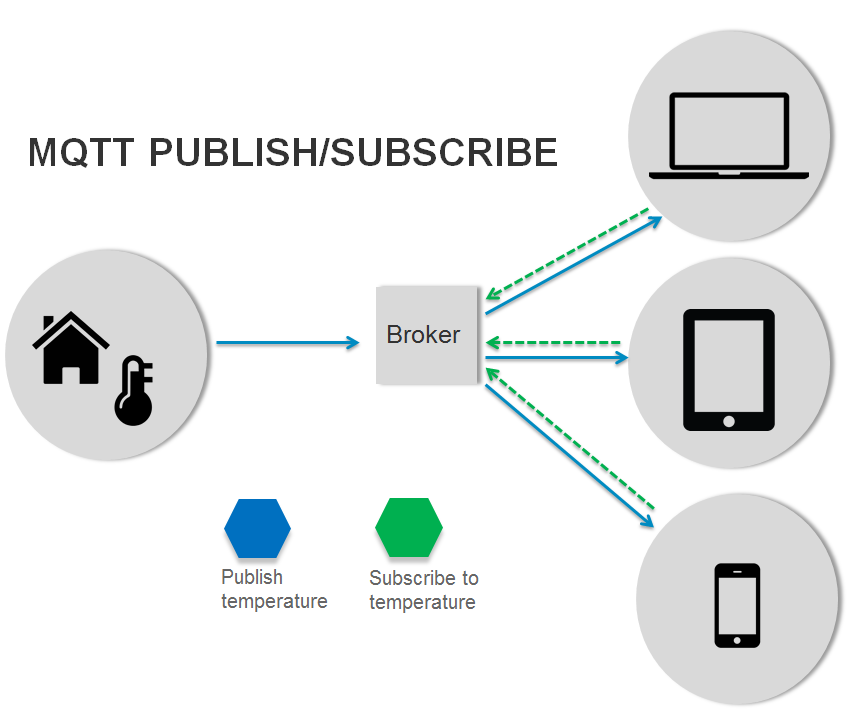
(`image source <http://internetofthingsagenda.techtarget.com/definition/MQTT-MQ-Telemetry-Transport>`_)

----

Paho & Mosquitto
----------------

The `Eclipse Paho <http://www.eclipse.org/paho/>`_ project provides open-source client implementations of MQTT and MQTT-SN messaging protocols.

Python Client
-------------

The Paho `Python Client <https://github.com/eclipse/paho.mqtt.python>`_ provides a client class with support for both MQTT v3.1 and v3.1.1 on Python 2.7 or 3.x. It also provides some helper functions to make publishing one off messages to an MQTT server very straightforward.

.. code-block:: python

   import paho.mqtt.client as mqtt
   def on_connect(client, userdata, rc):
	  print("Connected with result code "+str(rc))
	  client.subscribe("$SYS/#")
   def on_message(client, userdata, msg):
	  print(msg.topic+" "+str(msg.payload))
   client = mqtt.Client()
   client.on_connect = on_connect
   client.on_message = on_message
   client.connect("iot.eclipse.org", 1883, 60)
   client.loop_forever()

Mosquitto Server
----------------

`Mosquitto <http://projects.eclipse.org/projects/technology.mosquitto>`_ provides a lightweight server implementation of the MQTT and MQTT-SN protocols, **written in C**

Typically, the current implementation of Roger Light's Mosquitto has **an executable in the order of 120kB** that **consumes around 3MB RAM** with **1000 clients connected**. 

Mosquitto has a bridge which allows it to connect to other MQTT servers. 

----

HBMQTT
------

`HBMQTT <https://github.com/beerfactory/hbmqtt>`_ is an open source MQTT client and broker implementation.

Built on top of `asyncio <https://docs.python.org/3/library/asyncio.html>`_, Python's standard asynchronous I/O framework, HBMQTT provides a straightforward API based on coroutines, making it easy to write highly concurrent applications.

Publishing
..........

.. code-block:: python

   @asyncio.coroutine
   def test_coro2():
	C = MQTTClient()
        ret = yield from C.connect('mqtt://test.mosquitto.org:1883/')
        message = yield from C.publish('a/b', b'TEST MESSAGE WITH QOS_0', qos=QOS_0)
        yield from C.disconnect()

Or directly from cmd:

.. code-block:: bash

   $ hbmqtt_pub --url mqtt://localhost -t sensors/temperature -m 32 -q 1
   $ hbmqtt_pub --url mqtt://localhost -t my/topic < ./data
   
----

HBMQTT
------

Subscribing to a topic
......................

.. code-block:: python

   @asyncio.coroutine
   def uptime_coro():
	  C = MQTTClient()
	  yield from C.connect('mqtt://test.mosquitto.org/')
	  yield from C.subscribe([
	      ('$SYS/broker/uptime', QOS_1),
              ('$SYS/broker/load/#', QOS_2),
              ])
          for i in range(1, 100):
	      message = yield from C.deliver_message()
              packet = message.publish_packet
          yield from C.unsubscribe(['$SYS/broker/uptime', '$SYS/broker/load/#'])
          yield from C.disconnect()

   if __name__ == '__main__':
	  asyncio.get_event_loop().run_until_complete(uptime_coro())

.. code-block:: bash

   $ hbmqtt_sub --url mqtt://localhost -t '$SYS/#' -q 0

----

HBMQTT
------

Broker
......

.. code-block:: python

   import asyncio
   from hbmqtt.broker import Broker
   @asyncio.coroutine
   def test_coro():
	  broker = Broker()
	  yield from broker.start()
   if __name__ == '__main__':
	  asyncio.get_event_loop().run_until_complete(broker_coro())
	  asyncio.get_event_loop().run_forever()

And running from cmd:

.. code-block:: bash

   $ hbmqtt [-c <config_file> ] [-d]

**config.yaml**

.. code-block:: yaml

    listeners:
      default:
        type: tcp
        bind: 0.0.0.0:1883
    sys_interval: 20
    auth:
      allow-anonymous: true
    plugins:
      - auth_file
      - auth_anonymous

----

Constrained Application Protocol
--------------------------------

`CoAP <http://coap.technology/>`_ is another web transfer protocol for use with constrained nodes and constrained networks in the Internet of Things.

The protocol is designed for machine-to-machine (M2M) applications such as smart energy and building automation.

`CoAPython <https://github.com/Tanganelli/CoAPthon>`_, `txThings <https://github.com/mwasilak/txThings/>`_ and `aiocoap <https://pypi.python.org/pypi/aiocoap>`_

IoT protocol comparison
.......................

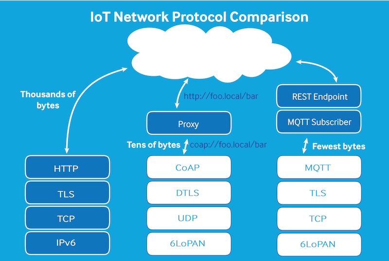

----

Human interaction
=================

.fx: section

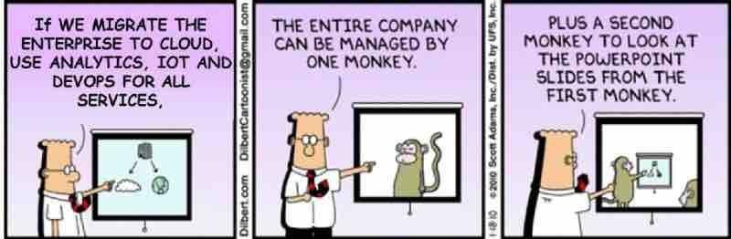

Let's provide the third monkey something nice to watch

----

Visualization
=============

Matplotlib in the browser
-------------------------

.. image:: images/mpld3.png
   :align: left

The `mpld3 <http://mpld3.github.io/index.html>`_ project brings together Matplotlib, and D3js, the popular Javascript library for creating interactive data visualizations for the web.

.. code-block:: python

   import matplotlib.pyplot as plt, mpld3
   plt.plot([3,1,4,1,5], 'ks-', mec='w', mew=5, ms=20)
   mpld3.fig_to_html()

Interesting option: `json-serializable dictionary representation of the figure <http://mpld3.github.io/modules/API.html#mpld3.fig_to_dict>`_

This would really simplify distributed graph generation and DB storage.

Does mpld3 work for large datasets?
...................................

(`from mpld3 faq <https://mpld3.github.io/faq.html>`_)

**Short answer: not really.** Mpld3, like matplolib itself, is designed for small to medium-scale visualizations, and this is unlikely to change. The reason is that mpld3 is built upon the foundation of HTML’s SVG, which is not particularly well-suited for large datasets. Plots with more than a few thousand elements will have noticeably slow response for interactive features.

Big data visualization requires specialized tools which do careful automatic data summarization and/or take direct advantage of your system’s GPU. There are a couple other Python projects that are making great headway in this area: **Bokeh** and `VisPy <http://vispy.org>`_ (GPU)

----

plot.ly
-------

 * MIT license
 * Good documentation

.. code-block:: python

   import plotly
   from plotly.graph_objs import Scatter, Layout
   plotly.offline.plot({
      "data": [
	  Scatter(x=[1, 2, 3, 4], y=[4, 1, 3, 7])
	  ],
      "layout": Layout(
	  title="hello world"
	  )
      })

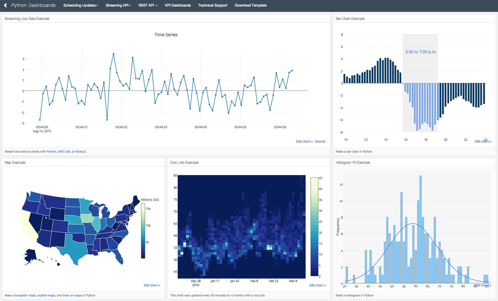

`Plotly <https://plot.ly/python/>`_ provides a web-service for hosting graphs and dashboards. 

Create a free account to get started. Graphs are saved inside your online Plotly account and you control the privacy. 

Public hosting is free, for private hosting, check out paid plans. 

----

Bokeh
-----

.. image:: images/bokeh.png
   :align: left
   :width: 10%

`Bokeh <http://bokeh.pydata.org>`_ is a Python interactive visualization library that targets modern web browsers for presentation. 

 * Elegant, concise construction of novel graphics in the style of D3.js
 * High-performance interactivity 
 * Very large or streaming datasets
 * Easy generation of offline interactive dashboards with javascript embedded data ( very valuable for our customers)

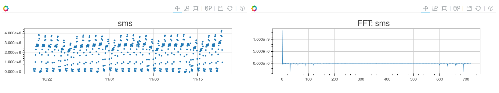

.. code-block:: python

   figure1=bokeh.plotting.figure(
       width=800,
       height=250,
       title=key1,
       x_axis_type="datetime")
       # automatically translate timestamps
   figure1.circle(x,y)
   figure2=bokeh.plotting.figure(
       width=800,
       height=250,
       title=key2,
       x_axis_type="datetime",
       x_range=figure1.x_range)
       # synchronize x-axis range (position and zoom) between figures
   figure2.circle(x2,y2)
   

----

Bokeh server
............

.. image:: images/bokeh_server.png
   :width: 50%
   :align: right

The `Bokeh server <http://bokeh.pydata.org/en/0.10.0/docs/user_guide/server.html>`_ is an optional component built on top of `Flask <http://flask.pocoo.org/>`_ that can be used to provide:

 * streaming data to automatically updating plots
 * interactively visualizing very large datasets
 * user authentication

Streaming example
_________________

.. code-block:: python

   import time
   from random import shuffle
   from bokeh.plotting import figure, output_server, cursession, show
   # prepare output to server
   output_server("animated_line")
   p = figure(plot_width=400, plot_height=400)
   p.line(
	[1, 2, 3, 4, 5], 
	[6, 7, 2, 4, 5], 
	name='ex_line'
	)
   show(p)
   # create some simple animation..
   # first get our figure example data source
   renderer = p.select(dict(name="ex_line"))
   ds = renderer[0].data_source
   while True:
	# Update y data of the source object
	shuffle(ds.data["y"])
	# store the updated source on the server
	cursession().store_objects(ds)
	time.sleep(0.5)
 

----

Alarm raising
=============

.fx: section

You can't expect operators to be continuously looking to the screen...

.. image:: images/fireman.png
   :width: 30%

----

Email alarms (smtplib)
----------------------

The classical approach is to just notify alarms through email:

.. code-block:: python

   import smtplib
   from email.mime.multipart import MIMEMultipart
   from email.mime.text import MIMEText
   me = "my@email.com"
   you = "your@email.com"
   # Create message container - the correct MIME type is multipart/alternative.
   msg = MIMEMultipart('alternative')
   msg['Subject'] = "Link"
   msg['From'] = me
   msg['To'] = you
   # Create the body of the message (a plain-text and an HTML version).
   text = "Mail message in plain text"
   html = "Main message in html format"
   # Record the MIME types of both parts - text/plain and text/html.
   part1 = MIMEText(text, 'plain')
   part2 = MIMEText(html, 'html')
   # Attach parts into message container.
   # According to RFC 2046, the last part of a multipart message, in this case
   # the HTML message, is best and preferred.
   msg.attach(part1)
   msg.attach(part2)
   # Send the message via local SMTP server.
   mail = smtplib.SMTP('smtp.gmail.com', 587)
   mail.ehlo()
   mail.starttls()
   mail.login('userName', 'password')
   mail.sendmail(me, you, msg.as_string())
   mail.quit()

----

mqttwarn
--------

`mqttwarn <https://github.com/jpmens/mqttwarn>`_ subscribes to arbitrary MQTT topics and uses plugins to notify services. 

.. image:: images/mqttwarn.png
   :align: left
   :width: 50%

Supported plugins:
    apns
    carbon
    dbus
    dnsupdate
    emoncms
    **file**
    freeswitch
    gss
    **http**
    instapush
    irccat
    linuxnotify
    log
    **mqtt**
    mqttpub
    mysql
    mysql_dynamic
    mythtv
    nma
    nntp
    **nsca**
    osxnotify
    osxsay
    pastebinpub
    pipe
    prowl
    pushalot
    pushbullet
    **pushover**
    redispub
    **rrdtool**
    slack
    **smtp**
    sqlite
    syslog
    twilio
    twitter
    xbmc
    xmpp
    xively
    zabbix
 
 * It's a great solution, specially if you are already using **mqtt**.

 * Usefull also as a protocol conversion bridge

 * Easy to extend with new plugins

 * `Read some interesting notes <http://jpmens.net/2014/04/03/how-do-your-servers-talk-to-you/>`_.

Example: smtp
.............

.. code-block:: ini

   [config:smtp]
   server  =  'localhost:25'
   sender  =  "MQTTwarn <jpm@localhost>"
   username  =  None
   password  =  None
   starttls  =  False
   targets = {
       'localj'     : [ 'jpm@localhost' ],
       'special'    : [ 'ben@gmail', 'suzie@example.net' ]
       }

----

Telegram bots
-------------

Receiving alarms as messages directly in mobile phone is a valuable feature for our customers. 
With `telebot <https://github.com/eternnoir/pyTelegramBotAPI>`_ for Telegram it's easy and fun!

.. code-block:: python

	  import telebot
	  TOKEN = '<token string>'
	  tb = telebot.TeleBot(TOKEN)
	  tb.send_message(chatid, text)

And lets say we want the operator to interact with the bot asking for a graph or status of a certain parameter:

.. code-block:: python

   @bot.message_handler(regexp="^STATUS *")
   def handle_message(message):
	  parameter= message.split(' ')[1]
	  parameter_status=get_status(parameter)
	  tb.send_message(chat_id, parameter_status)

   @bot.message_handler(regexp="^GRAPH *")
   def handle_message(message):
	  parameter= message.split(' ')[1]
	  parameter_graph=get_plot(parameter)
	  tb.send_photo(chat_id, parameter_graph)

* `Keyboard layout <https://github.com/eternnoir/pyTelegramBotAPI#reply-markup>`_ can be modified to suit UI needs.

* `Asynchronous delivery of messages <https://github.com/eternnoir/pyTelegramBotAPI#asynchronous-delivery-of-messages>`_ is also possible

----

Conclussions
============

.fx: section

Key issues to consider
----------------------

* Design based on **abstraction layers** VS **glue code**.
* Multiprotocol support
* Distributed architecture
* Differentiate online/offline analytic layers
* Pipeline design for analytics workflow
* Plugable support for data storage systems

----

Presenter's choice
------------------

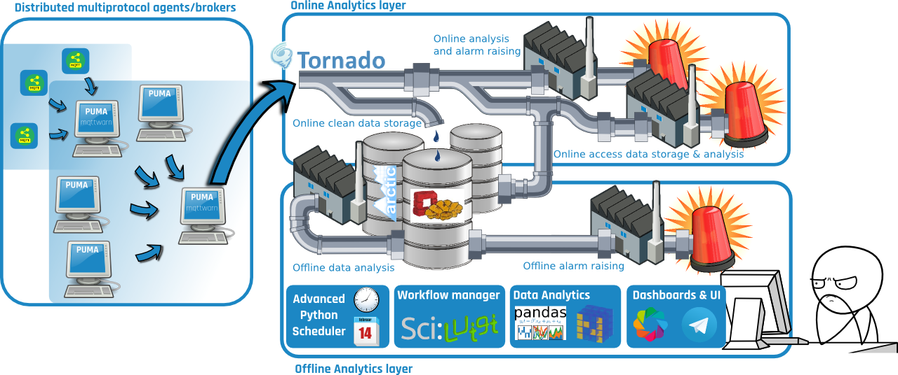

Design and deployment of a Full Stack Python Monitoring+Analytics Framework **is possible**.

* **PUMA**: Python universal monitoring agent (new project)
* **MQTT** as default internal messaging protocol
* **Tornado** based message queue
* **Luigi** for data analysis workflow management
* Online analytics layer -> **Gnocchi** 
* Offline analytics layer -> **Arctic** (*MongoDB*)
* **Advanced Python Scheduler** (*MongoDB*)
* **Bokeh** for dashboard generation
* **Telegram bots** for additional UI

Presenter Notes
---------------

* **PUMA**: Python universal monitoring agent (new development)
 * Pure python with low requirements
 * In the spitit of mqttwarn (integration)
 * Multiprotocol support
 * Bridging facilities

----

So Long!
========

and thanks for all the fish
---------------------------

`Pablo Manuel García Corzo (pablo.manuel.garcia@blue-tc.com) <mailto:pablo.manuel.garcia@blue-tc.com>`_

.fx: solong

